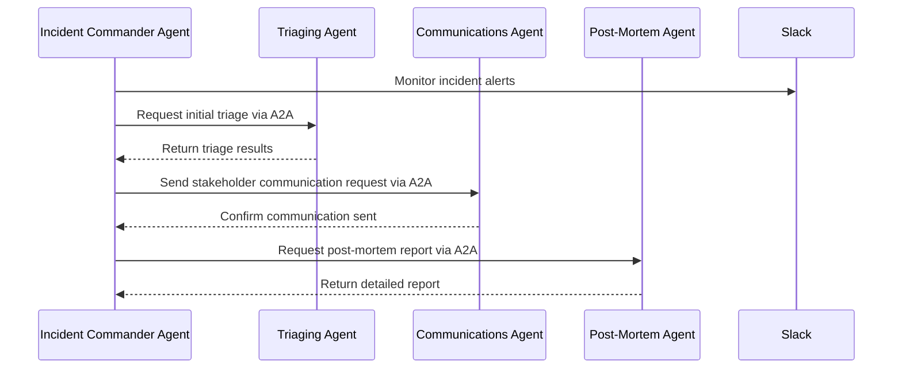
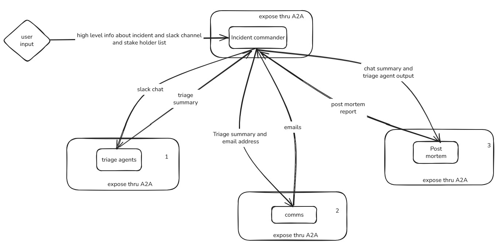

# Agent2Agent Incident Automation Platform

## Overview
This project demonstrates a **multi-agent system** for automated **incident coordination, triaging, stakeholder communication, and post-mortem reporting** — all powered by an **Agent2Agent (A2A) communication protocol**.

It combines agents built with:
- **OpenAI Agent SDK**
- **Google ADK**
- **Autogen**

Agents are **independent remote services** that discover and communicate with each other using the **A2A protocol** and **Agent Cards**.  
Each agent operates autonomously but collaborates through structured A2A messages, enabling seamless orchestration across different SDKs.

---

## Key Features
- **Incident Commander Agent**:
  - Monitors Slack channels for incident reports.
  - Orchestrates the workflow by delegating tasks to specialized agents.

- **Triaging Agent**:
  - Performs the initial incident triage.
  - Provides root cause hypotheses and priority classification.

- **Communications Agent**:
  - Sends real-time incident communication emails to stakeholders.

- **Post-Mortem Agent**:
  - Generates detailed post-mortem reports.
  - Summarizes actions taken, timelines, and lessons learned.

---

## Architecture
The platform uses **[python-a2a](https://pypi.org/project/python-a2a/)** to enable cross-agent communication.  
Each agent exposes its capabilities through an **Agent Card** at:

```
http://127.0.0.1:<port>/a2a/agent.json
```

The Agent Card contains metadata like:
- Agent name & description
- Supported actions
- Endpoint information

Agents use this metadata to discover and invoke each other without hard-coded dependencies.

---

## Workflow
1. **Incident Commander Agent** get access to slack chat
2. It calls the **Triaging Agent** for initial analysis.
3. It then invokes the **Communications Agent** to send stakeholder updates.
4. Finally, it triggers the **Post-Mortem Agent** to generate a complete report.

---

## A2A Communication Flow



---

## Tech Stack
- **Agent SDKs**:
  - OpenAI Agent SDK
  - Google ADK
  - Autogen  
- **A2A Communication**:
  - [`python-a2a`](https://pypi.org/project/python-a2a/)
- **Language**: Python 3.10+
- **Messaging/Chat**: Slack API integration

---

## Installation

```bash
# Clone repository
git clone https://github.com/yourusername/a2a-incident-automation.git
cd a2a-incident-automation

# Install dependencies
uv pip install -r requirements.txt
```

---

## Running the Agents
Each agent runs as a separate service with its own Agent Card.

```bash
# Example: Start Incident Commander Agent
uv run .\a2a_communication\incident_commander_agent.py

# Example: Start Triaging Agent
uv run .\a2a_communication\incident_triage_agent.py

# Example: Start Communications Agent
uv run .\a2a_communication\incident_comms_agent.py

# Example: Start Post-Mortem Agent
uv run .\a2a_communication\incident_post_mortem_agent.py

# To trigger the flow
uv run .\a2a_communication\multi_agent_trigger.py
```


Once running, agents will automatically discover each other via their **Agent Cards**.

---

## Example Agent Card (JSON)
```json
{
  "name": "IncidentPostMortemAgent",
  "description": "Agent to assist in creating a post-mortem report for incidents.",
  "url": null,
  "version": "1.0.0",
  "capabilities": {
    "streaming": true,
    "pushNotifications": false,
    "stateTransitionHistory": false,
    "google_a2a_compatible": true,
    "parts_array_format": true
  },
  "defaultInputModes": [
    "text/plain"
  ],
  "defaultOutputModes": [
    "text/plain"
  ],
  "skills": []
}
```

---

## Future Enhancements
- Integration with PagerDuty for automated incident triggers.
- Adding more specialized agents (e.g., root cause analysis, incident simulation).
- Secure A2A communication with mutual TLS.

---

## License
MIT License
