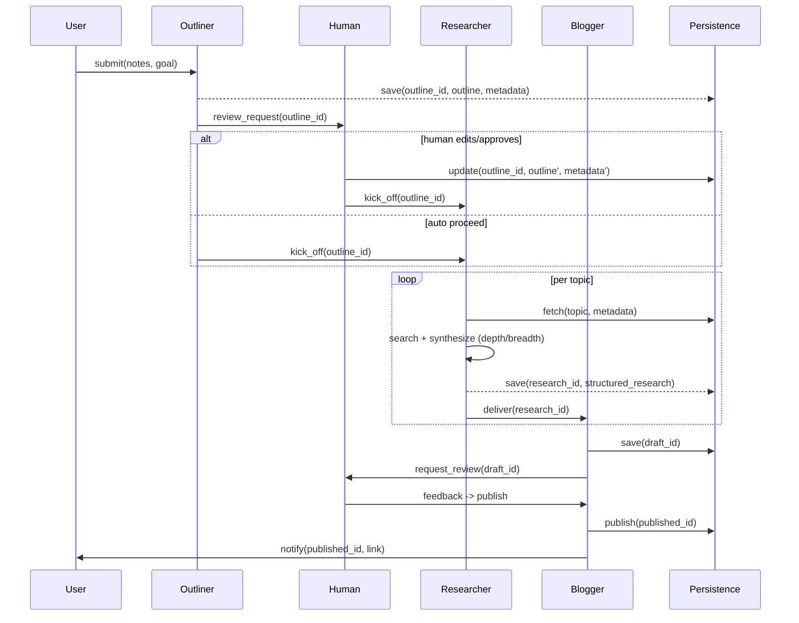

# Crew AI — 3-Agent Architecture (Outliner, Researcher, Blogger)

This file is a coherent specification for a 3-agent AI pipeline that converts notes into publishable articles. Each agent is specified with an Observe→Plan→Act contract, required tools and memory, sample prompt templates, data schemas, and a sequence diagram.

---

## Overview

- Goal: transform user notes and a main topic/goal into a complete article with citations and optional code.
- Agents:
  1. Outliner — creates a prioritized, ordered set of subtopics with metadata.
  2. Researcher — performs metadata-driven research on each topic.
  3. Blogger — composes the final article from research artifacts.
- Optional: Human-in-the-loop (HITL) for review after outlining and before publishing.

---

## Sequence flow (Mermaid)

Paste this block into a Markdown renderer that supports Mermaid to visualize the end-to-end orchestration.



---

## Agent contracts (Observe → Plan → Act)

Each agent follows an Observe→Plan→Act loop. Below are concise contracts and example prompt templates for each agent.

### Outliner
- Observe: user notes, goal, optional prior outlines
- Plan: identify subtopics, deduplicate, rank, assign metadata (depth/breadth/need_code)
- Act: persist outline (outline_id), optionally trigger HITL

Tools: keyphrase extractor, embedding service, clustering library

Memory: short-term (current notes), long-term (outline history)

Sample output (Topic JSON):

```json
{
  "id": "topic-001",
  "title": "Working Memory",
  "summary": "Short description",
  "priority": 10,
  "required_depth": "deep",
  "breadth_required": true,
  "need_code_example": false,
  "estimated_length": 800
}
```

Sample Outliner prompt:
```
You are an Outliner agent. Given the notes and goal, return a JSON array of topic objects with metadata. Keep titles concise (<=6 words).
```

---

### Researcher
- Observe: a Topic (with metadata) + goal
- Plan: choose search strategy, call tools, synthesize facts and evidence, score confidence
- Act: persist StructuredResearch and return research_id

Tools: search APIs, web-scraper, PDF extractor, citation parser, optional code sandbox

Memory: STM (active tasks), LTM (citation/cache index)

StructuredResearch shape:

```json
{
  "research_id": "r-001",
  "topic_id": "topic-001",
  "summary": "A short summary",
  "facts": [{"text":"...","source":"https://...","confidence":0.9}],
  "evidence": [{"snippet":"...","source":"https://..."}],
  "code_examples": [{"language":"python","code":"..."}],
  "references": ["https://..."]
}
```

Sample Researcher prompt (metadata-driven):
```
You are a Researcher agent. For topic: {title}. required_depth={required_depth}, breadth_required={breadth_required}. Return JSON with summary, facts, evidence, code_examples (if required), and references. Prioritize authoritative sources and attach confidence scores.
```

Notes:
- Use a tool registry with rate limits and structured outputs.
- Make research tasks idempotent and cache results.

---

### Blogger
- Observe: ordered outline + list of StructuredResearch items + persona/tone/format
- Plan: synthesize a narrative, insert citations and code examples, enforce tone and formatting
- Act: persist draft, request HITL review, publish on approval

Tools: style/lint tool, markdown renderer, citation formatter, publish connector

Memory: draft state (STM), published history (LTM)

Sample Blogger prompt:
```
You are a Blogger agent. Given the outline and research artifacts, write a polished article in {tone} and {format}. Include inline citations and a references section. Output a Markdown string and metadata (word_count, references).
```

---

## HITL (Human-in-the-loop)

- When: after Outliner (structure review) and after Blogger (final edit/review)
- Purpose: fix duplicates, reorder topics, adjust metadata, fact-check high-impact claims
- Implementation: review queue + small web UI, asynchronous approve/edit callbacks

---

## API surface (recommended)

- POST /outlines -> create_outline(notes, goal) -> outline_id
- GET /outlines/{id} -> retrieve outline
- POST /outlines/{id}/approve -> approve outline (HITL)
- POST /research -> request_research(outline_id, topic_id) -> research_id
- GET /research/{id} -> retrieve StructuredResearch
- POST /drafts -> create draft from research_ids -> draft_id
- POST /publish/{draft_id} -> publish

---

## Error handling & observability

- Tracing: propagate request_id and topic_id across agents
- Retries: exponential backoff for flaky tools, circuit-breaker for persistent failures
- Degradation: mark research outputs as partial/degraded and surface to HITL
- Metrics: task latency, success rate, tool error rates, HITL queue size

---

## Design recommendations

- Prompt templates: keep metadata-driven prompt templates in `prompt_sdk` (CoT/ReAct/ToT selection)
- Tools: wrap external APIs with policy layers (rate limits, allowed domains)
- Memory: Redis for STM; SQLite/Postgres + S3 for LTM
- Modularity: keep agents small and testable; orchestrator handles coordination

---

## Next steps


