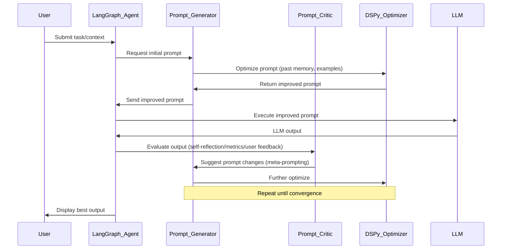

# Solution Architecture

## Approach
The solution is an agentic system that generates, evaluates, and iteratively improves prompts for LLMs using meta-prompting and self-reflection. Leveraging DSPy for automatic prompt optimization and LangGraph for robust agent orchestration and state management, the system cycles through prompt generation, usage, performance evaluation, and self-improvement. The agent reflects on each LLM interaction, updates its meta-prompt, and adapts to produce higher-quality prompts over time. Multi-agent collaborations (e.g., Critic, Generator, User Simulator) and adaptive learning from experience (reward, stratify by difficulty, etc.) further boost capabilities.

## Architecture Diagram

## Design Patterns
- Agentic Design: Generator, Critic/Evaluator, Orchestrator (LangGraph agents/nodes)
- Meta-prompting: Agent self-reflection loop (reflect/evaluate/rewrite prompts)
- Learning Loop: Experience replay, reward-based self-improvement (reinforcement-inspired)
- Modular pipeline: Swappable nodes (plug in new LLMs, optimizers, critics)
- Memory pattern: Store history of contexts, outputs, reflections per episode/task
- Multi-agent collaboration: Can extend to distributed agents (e.g. multiple critics, domain experts)

## LLM, SDKs, Tools, Frameworks
- LLMs: GPT-4, Gemini Pro, Claude 3 Opus, (optionally open-weight: Llama-3)
- SDK/Frameworks: DSPy (Stanford's Declarative Self-improving Python), LangGraph (for agent graph orchestration), LangChain (if additional chaining needed), FastAPI/Streamlit (UI)
- Tooling: Weights & Biases or MLflow for experiment tracking; Redis/Postgres for memory/cache
- Prompt engineering: PromptLayer or equivalent for prompt tracing and versioning

## Detailed Design
1. **System Initialization:**
    - Select base LLM and initialize LangGraph agent graph (nodes for generator, critic, user-simulator, memory).
    - Configure DSPy pipeline for prompt optimization (define objectives/metrics: answer accuracy, brevity, user satisfaction).

2. **Prompt Generation:**
    - User submits task/context.
    - Prompt Generator node creates an initial prompt using prompt templates and meta-instructions (System 2 reasoning encouraged).
    - Memory node provides history/episodes/examples.

3. **Prompt Optimization:**
    - DSPy optimizer iteratively adjusts the prompt (few-shot/CoT, etc.) using feedback from prior outputs and evaluations.
    - Optionally stratify past experiences by outcome/difficulty for adaptive learning.

4. **LLM Execution:**
    - Orchestrator triggers LLM with optimized prompt.
    - LLM output is processed by Critic agent.

5. **Self-Reflection & Improvement:**
    - Prompt Critic/Meta-Agent evaluates output (rule-based, score-based, or LLM-assisted reflection).
    - Agent suggests prompt rewrites and iteratively calls DSPy for further optimization.
    - (Optional) User or synthetic feedback loop closes the evaluation cycle.

6. **Memory & Experience Pool:**
    - All interactions, feedback, and prompt evolutions are stored in memory for replay and continued improvement.

7. **Extension:**
    - Add more specialized agents (domain-specific critics, multi-modal prompters, etc.)
    - Plug in advanced LLMs via API or on-prem.

8. **Deployment:**
    - Use REST API/UI to submit prompt tasks and review progress/outputs.
    - Monitor learning via experiment tracking dashboard.

## Prompting Technique
- Meta-prompting (reflection on instruction quality and prompt improvement)
- Chain-of-Thought (CoT) prompting to encourage multi-step reasoning
- System 2 style prompts to force deliberation
- In-context learning and few-shot examples (sourced from memory pool)
- Critique-then-rewrite: LLM reviews and rewrites its own prompt instructions
- Adaptive prompting: dynamically adjust prompt complexity by accumulated task experience

## GitHub Links
- DSPy: https://github.com/stanfordnlp/dspy
- DSPy Optimizer (MIPROv2) example: https://github.com/stanfordnlp/dspy/blob/main/tutorials/04_optimizing_with_miprov2.ipynb
- LangGraph: https://github.com/langchain-ai/langgraph
- LangGraph demo/templates: https://github.com/langchain-ai/langgraph-examples
- Meta-Prompt agent (concept): https://github.com/aminya/meta-prompt (simplified)
- Prompt Reflection/Optimization demo: https://github.com/magistermaks/meta-prompt-reflection

