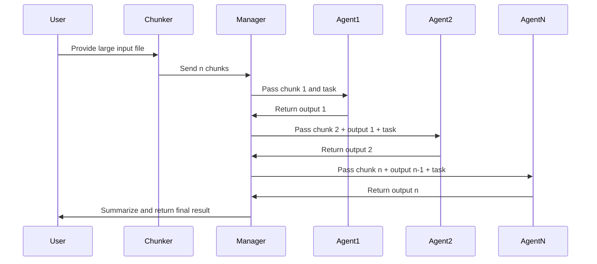

# Chain of Agents

## Overview

This module implements a **chain of agents** architecture for processing large text inputs. The workflow is designed to break down complex tasks into manageable steps, leveraging multiple specialized agents.

## Where and Why Chain of Agents is Useful?

Even when you are working with state-of-the-art models, you can notice that tasks with long context, like entire books, long articles, or lengthy conversations, still remain a challenge for LLMs. One of the widespread ideas is to expand the model’s memory, in other words, context window. However, models tend to lose track of main information as the input grows longer. Another way is to shorten input instead by selecting only the most relevant parts of the text. Here RAG may be used for effective retrieval, but this method may lead to losing important parts of information.

Chain of Agents (CoA) follows a chain structure with a strong order, at the same time ensuring agents share information for better accuracy.

## Workflow

1. **Chunking**: The input text is divided into smaller chunks.
2. **Worker Agents**: Each chunk is assigned to a worker agent.  
   - The first agent processes its chunk and passes the result to the next agent.
   - Each subsequent agent receives the previous agent's output along with its own chunk, processes them, and passes the result forward.
   - This continues until all worker agents have processed their respective chunks.
3. **Manager Agent**:  
   - After all worker agents finish, the manager agent collects the final output from the last worker.
   - The manager aggregates all insights and produces the final response—such as an answer, summary, or completed code.

## Implementation

- **Input**: A large file is provided as input.
- **Chunker**: The input is split into chunks of size `k`. If there are `n` chunks, these are passed to the manager.
- **Manager**:
  - Takes the first chunk, instantiates the first sub agent, and passes the task (as a system prompt) and the chunk to the agent.
  - Once the sub agent finishes, the manager takes the next chunk and the previous agent's output, starts a new sub agent, and passes the task and chunk.
  - This loop continues until all chunks are processed.
  - The manager then takes the output from the last sub agent, summarizes the results, and returns the final output.

## Sequence Flow Diagram

## Benefits

- **Scalability**: Handles large inputs by distributing work across agents.
- **Modularity**: Each agent can be specialized for different types of processing.
- **Collaboration**: Results are refined step-by-step, improving quality and depth.

## Example Use Cases

- Summarizing lengthy documents
- Multi-step code generation
- Complex data analysis workflows

---

*For implementation details, see the source code.*

## References

- [Chain of Agents and Co-RAG: A new paradigm for long-context LLMs](https://huggingface.co/blog/Kseniase/coa-and-co-rag)
- [Chain of Agents: Large language models collaborating on long-context tasks](https://research.google/blog/chain-of-agents-large-language-models-collaborating-on-long-context-tasks/)