# 📍 Address to Google Maps Coordinates Agent

An AI-powered solution that extracts addresses from text or images and converts them to precise Google Maps coordinates. Perfect for delivery agents, home service providers, and anyone who needs to navigate to addresses without making phone calls.

## 🎯 Problem Statement

Delivery agents and home service providers often face challenges when navigating to customer locations:
- Customers provide addresses in informal or incomplete formats
- Addresses written on delivery boxes/labels may be hard to interpret
- Time wasted on phone calls to clarify locations
- Manual address lookup is error-prone and slow

## 💡 Solution

This project uses AI agents to:
1. **Extract addresses** from typed sentences or images (e.g., handwritten labels on delivery boxes)
2. **Validate addresses** using Google Maps Address Validation API
3. **Get precise coordinates** (latitude/longitude) for the extracted address
4. **Display location** on Google Maps for easy navigation

## 🚀 Features

- **Text-based Address Extraction**: Parse addresses from natural language sentences
- **Image-based Address Extraction**: Read addresses from photos of delivery boxes, labels, or handwritten notes
- **Address Validation**: Verify and standardize addresses using Google Maps API
- **Geocoding**: Convert addresses to precise lat/long coordinates
- **Map Visualization**: Display the validated location on Google Maps

## � Overall Flow

```mermaid
flowchart LR
    A[📝 Text Input] --> C[🤖 AI Agent]
    B[📷 Image Input] --> C
    C --> D[📍 Address Extraction]
    D --> E[✅ Google Maps API\nAddress Validation]
    E --> F[🌐 Geocoding\nLat/Long]
    F --> G[🗺️ Display on\nGoogle Maps]
```



### Step-by-Step Workflow

| Step | Component | Description |
|------|-----------|-------------|
| **1** | **Input** | User provides address via text (typed sentence) or image (photo of delivery box/label) |
| **2** | **AI Agent** | Processes the input using NLP (for text) or OCR (for images) to understand the content |
| **3** | **Address Extraction** | Extracts structured address components from the raw input |
| **4** | **Address Validation** | Sends extracted address to Google Maps Address Validation API for verification and standardization |
| **5** | **Geocoding** | Retrieves precise latitude and longitude coordinates for the validated address |
| **6** | **Map Display** | Renders the location on Google Maps for easy navigation |

### Example Flow

```
Input: "Please deliver to some address"
           ↓
AI Agent extracts: "some address"
           ↓
Google Maps validates and returns: 
  - Formatted Address: "some address"
  - Coordinates: (some lat, some lng)
           ↓
📍 Location displayed on Google Maps
```

## �🛠️ Tech Stack

- **Python** - Core programming language
- **Google Maps API** - Address validation and geocoding
- **AI/ML Models** - For text and image-based address extraction
- **python-dotenv** - Environment variable management

## 📦 Installation

1. Clone the repository:
```bash
git clone https://github.com/yourusername/google_map_agent.git
cd google_map_agent
```

2. Install dependencies:
```bash
pip install googlemaps python-dotenv
```

3. Set up environment variables:
Create a `.env` file in the root directory:
```env
GOOGLE_MAPS_API_KEY=your_google_maps_api_key_here
```

## 🔑 Getting Google Maps API Key

1. Go to [Google Cloud Console](https://console.cloud.google.com/)
2. Create a new project or select an existing one
3. Enable the following APIs:
   - Geocoding API
   - Address Validation API
   - Maps JavaScript API (for visualization)
4. Create credentials (API Key)
5. Add the API key to your `.env` file

## 📖 Usage

### Basic Address Validation

```python
import googlemaps
from dotenv import load_dotenv
import os

load_dotenv()
gmaps = googlemaps.Client(key=os.getenv('GOOGLE_MAPS_API_KEY'))

# Validate an address
result = gmaps.addressvalidation(
    ['Your Address Here'], 
    regionCode='IN',  # Change to your country code
    enableUspsCass=False
)
print(result)
```

### Geocoding an Address

```python
# Get coordinates from an address
geocode_result = gmaps.geocode('1600 Amphitheatre Parkway, Mountain View, CA')
lat = geocode_result[0]['geometry']['location']['lat']
lng = geocode_result[0]['geometry']['location']['lng']
print(f"Coordinates: {lat}, {lng}")
```

## 🗺️ Use Cases

| Use Case | Description |
|----------|-------------|
| **Delivery Services** | Quickly locate customer addresses from order notes or package labels |
| **Home Services** | Service technicians can navigate to job sites without customer calls |
| **E-commerce** | Validate shipping addresses before dispatch |
| **Logistics** | Optimize delivery routes with accurate coordinates |

## 🔮 Future Enhancements

- [ ] OCR integration for reading addresses from images
- [ ] Multi-language address support
- [ ] Batch address processing
- [ ] Route optimization for multiple addresses
- [ ] Mobile app integration
- [ ] Voice-based address input

## 🤝 Contributing

Contributions are welcome! Please feel free to submit a Pull Request.

## 📄 License

This project is licensed under the MIT License - see the [LICENSE](LICENSE) file for details.

## 📞 Support

If you have any questions or need help, please open an issue in the repository.

---

**Made with ❤️ for delivery agents and service providers worldwide**
